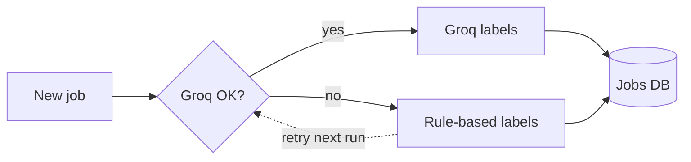
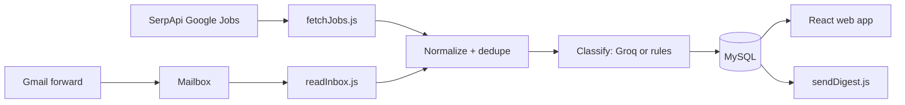

# ArchJobs — PRD: Architecture & BIM Job Finder + Tracker

Sep 24, 2026 · @Aditya

## Overview

ArchJobs is one clean dashboard that collects architecture and BIM internships and fresher jobs, with direct apply links and an application tracker. It targets Bengaluru first, then other Indian cities.

**Problem.** Architecture and BIM roles are scattered across LinkedIn, Naukri, Indeed and firm career pages. Search results mix in unrelated "architect" roles such as software or cloud architect. Salary is rarely listed, and tracking applications and follow-ups across tabs gets messy.

**Users.**

- Phase 1: one user, a final-year B.Arch student seeking BIM or architecture internships, with Bengaluru as priority.
- Phase 2: architecture students in general, as a public platform on our own domain.

**Success metrics (Phase 1).**

| Metric | Target |
| --- | --- |
| Relevant new roles surfaced | 20+ per week |
| Irrelevant roles in feed (e.g. software architect) | Under 10% |
| Time from a LinkedIn alert email to showing in dashboard | Under 15 min |
| Applications tracked with follow-up dates | 100% |
| Monthly running cost | ₹0 |

## Scope

The MVP is a single-user app for her, built in about two weekends. Public multi-user features come only after it proves useful.

| Phase | Includes |
| --- | --- |
| MVP (Phase 1) | Job feed from SerpApi (Google Jobs) and LinkedIn alert emails; Groq classification with rule-based fallback; filters; apply links; tracker; firms list; daily email digest |
| Phase 2 | Greenhouse/Lever firm career-page polling; salary estimates; follow-up reminders; mobile-friendly PWA install |
| Phase 3 (public) | Sign-up and login, per-user profiles and alerts, shared job cache across users, admin panel |

**Non-goals.**

- No scraping of LinkedIn and no automation of her LinkedIn account. This avoids account bans and breaking LinkedIn's terms.
- No auto-apply. Every application is sent by her through the original link.
- No resume or portfolio hosting in v1; her portfolio site is a separate project.

## Data sources

Free sources feed one normalized jobs table. LinkedIn roles arrive through her own job-alert emails, not scraping.

> **Change (Sep 24, 2026):** JSearch and Adzuna are replaced by a single source, the [SerpApi Google Jobs API](https://serpapi.com/google-jobs-api). Google Jobs already aggregates LinkedIn, Naukri, Indeed and firm career pages, so one key covers what the two APIs did.

| Source | What it gives | Free limit | Fetch schedule |
| --- | --- | --- | --- |
| [SerpApi Google Jobs](https://serpapi.com/google-jobs-api) | Google Jobs results (incl. LinkedIn, Naukri, Indeed and career-page listings), apply options, posted time, sometimes salary | 250 searches/month, 50/hour | 2x daily, up to 3 queries each (\~180/month) |
| LinkedIn alert emails via Gmail | Roles from her LinkedIn job alerts, near real-time | Free | Every 10 min |
| Greenhouse / Lever public boards (Phase 2) | Openings posted directly by specific firms | Free, no key | Daily |

**LinkedIn email pipeline.**

1. She creates LinkedIn job alerts: "BIM intern", "Revit", "architectural intern", "junior architect", location Bengaluru.
2. Gmail filter: from `jobalerts-noreply@linkedin.com` → auto-forward to a dedicated inbox (e.g. `jobs@yourdomain`) on Hostinger email.
3. A cron script reads that inbox over IMAP, parses each job card (title, company, location, link), and inserts new rows.
4. Alternative: Gmail API with read-only OAuth scope on her account, filtered by sender. The IMAP forward is simpler and needs no Google app verification, so it is the default.

**Search queries (starting set).** `BIM intern Bengaluru`, `Revit architect intern Bangalore`, `architectural intern Bangalore`, `BIM modeler fresher Bangalore`, `junior architect Bengaluru`. Rotate queries across runs to stay within the SerpApi quota. Before each run the app reads the remaining searches from SerpApi's free account endpoint and spreads them over the rest of the month.

**Deduplication.** Key = normalized `company + title + city`. When duplicates come from several sources, keep one row, merge the source badges, and prefer the direct company or LinkedIn apply link.

## Features and requirements

The app has five parts: the job feed, job detail, tracker, firms list and notifications. Every job card must have a working apply link.

| ID | Feature | Requirement | Phase |
| --- | --- | --- | --- |
| F1 | Job feed | List of relevant jobs, newest first; badges for source, "New" (under 24h), Internship/Fresher, BIM | MVP |
| F2 | Filters | City (Bengaluru default), role type, software (Revit, Navisworks, SketchUp, AutoCAD), posted within, source, hide applied | MVP |
| F3 | Apply link | One tap opens the original posting in a new tab; clicking prompts "Mark as applied?" | MVP |
| F4 | Salary | Show posted stipend or salary; if missing, show a "Market estimate" range labeled clearly (middle 50% of stipends posted for the same role type, from our own data) | MVP |
| F5 | Tracker | Kanban or table: Saved → Applied → Interview → Offer / Rejected; date applied, contact, notes | MVP |
| F6 | Follow-ups | Auto-set a follow-up date 7 days after applying; highlight overdue ones | Phase 2 |
| F7 | Firms list | Cold-email targets: firm, city, website, contact email, date emailed, reply status | MVP |
| F8 | Daily digest | 8 AM email with new matching roles since yesterday | MVP |
| F9 | Instant alert | Optional push or email when a high-match BIM role appears (from LinkedIn email pipeline) | Phase 2 |
| F10 | Hide / not relevant | One click hides a job and logs it, improving the filter rules | MVP |

**Rules.**

- Jobs older than 30 days are archived automatically unless saved or tracked.
- Apply links are checked at ingest; a broken link marks the job "Link may be expired".
- All times shown in IST.

## AI classification with fallback

Groq labels each new job; if Groq fails, a rule-based classifier takes over automatically so the feed never stops.

**Groq output (strict JSON per job).** `is_relevant` (bool), `role_type` (internship / fresher / experienced), `is_bim` (bool), `software` (list), `stipend_or_salary` (text or null), `match_score` (0–100), `reason` (one line).

**When the fallback runs.** Groq returns an error, times out after 10 s, hits the rate limit (HTTP 429), or returns invalid JSON twice. Jobs labeled by fallback get `classifier = "rules"` and are re-sent to Groq on the next run.

**Rule-based fallback.**

- Include if title or description has: architect, architectural, B.Arch, BIM, Revit, Navisworks, junior architect, design intern.
- Exclude if it has: software, solution, cloud, data, enterprise, network, security, Salesforce, AWS, Java.
- Role type from words: intern / internship / trainee → internship; fresher / 0–1 year / graduate → fresher; "3+ years" or more → experienced (hidden by default).
- Software = the listed tool names found in the text; salary = regex for ₹, INR, LPA, "per month", "stipend".
- Score = 40 base + 20 if BIM or Revit + 20 if internship or fresher + 20 if Bengaluru.

**Is the fallback worth it?** Yes. It is about 60 lines of code, costs nothing, and means the feed keeps working during outages or rate limits. It also gives a baseline to measure whether Groq actually improves accuracy.

## UI and UX

The UI is a calm, minimal dashboard with three main screens. The design rule: any job can be found and applied to in two taps.

| Screen | Layout | Key elements |
| --- | --- | --- |
| Jobs (home) | Filter bar on top; card list below; detail panel slides in from the right (full screen on mobile) | Card: title, firm, city, stipend or "Est. range", posted time, source badges, BIM/Intern tags, Save and Apply buttons |
| Tracker | Kanban columns: Saved, Applied, Interview, Offer, Rejected (table view toggle) | Drag cards between columns; follow-up date shown in amber when due, red when overdue |
| Firms | Searchable table | Firm, city, type (design studio / BIM consultancy / developer), contact, last emailed, status |
| Settings | Simple form | Keywords, cities, digest time, notification email |

**Design principles.**

- Neutral palette with one accent color; generous white space; system fonts or Inter with fallbacks.
- Mobile-first: she will check it mostly on her phone. Tap targets at least 44 px, bottom navigation on mobile.
- Light and dark mode.
- Empty states that guide: "No new BIM roles today — here are 5 firms to cold-email."
- A counter on top: "12 new today · 3 follow-ups due".
- No clutter: no ads, no dense tables on the home screen, description collapsed behind "Read more".

**Accessibility.** Text contrast at least 4.5:1, keyboard navigable, labels on all icons.

## Architecture and tech stack

Everything runs on the existing Hostinger plan and domain in JavaScript end to end: a Node.js (Express) app with MySQL, a React frontend, and scheduled jobs for fetching.

| Layer | Choice | Why |
| --- | --- | --- |
| Frontend | React (Vite build), served by the Node app | Same language as the backend; fast builds |
| Backend | Node.js (Express) REST API | One language across the stack; mature libraries for APIs, IMAP, email and LLM calls |
| Database | MySQL (Hostinger) via mysql2 or Prisma | Included in plan |
| Scheduler | node-cron in the app, or Hostinger cron calling protected endpoints | Fetch APIs, read inbox, classify, send digest |
| Email in | Hostinger mailbox + imapflow (Node IMAP) | Receives forwarded LinkedIn alerts |
| Email out | Nodemailer via Hostinger SMTP (or Brevo free tier) | Daily digest and alerts |
| AI | Groq API (free tier) + rule fallback | Classification |
| Auth (MVP) | Single password or HTTP basic auth | One user; real login in Phase 3 |

A Node.js app needs a Hostinger plan with Node.js hosting; check hPanel for a Node.js app option before building. If the current plan lacks it, upgrade to a tier that has it or use a small VPS. A VPS is also required only if headless-browser scraping is ever added, which is out of scope.

**Cron schedule.**

- `readInbox.js` every 10 min
- `fetchJobs.js` at 7:00 and 18:00 IST
- `retryClassify.js` hourly
- `sendDigest.js` at 8:00 IST

**Secrets.** API keys (SerpApi, Groq, mailbox password) live in a server-side `.env` file loaded with dotenv, never committed to git or bundled into frontend code.

## Data model

Four tables cover the MVP; a `users` table and `user_id` columns are added in Phase 3.

| Table | Key columns |
| --- | --- |
| `jobs` | id, dedupe\_key (unique), title, company, city, description, apply\_url, sources (JSON), posted\_at, salary\_text, salary\_min, salary\_max, salary\_is\_estimate, role\_type, is\_bim, software (JSON), match\_score, classifier (groq / rules), is\_hidden, is\_archived, created\_at |
| `applications` | id, job\_id, status (saved / applied / interview / offer / rejected), applied\_at, follow\_up\_at, contact\_name, contact\_email, notes |
| `firms` | id, name, city, type, website, contact\_email, last\_emailed\_at, status (not contacted / emailed / replied / no reply), notes |
| `fetch_log` | id, source, run\_at, jobs\_found, jobs\_new, requests\_used, error |

`fetch_log.requests_used` tracks SerpApi searches; fetching pauses when 10 of the 250 monthly searches are left (SerpApi's account endpoint is checked first, the log is the fallback).

## Risks, costs and milestones

The MVP costs ₹0 a month on top of the existing Hostinger plan. The main risk is the free API quotas running out once the platform goes public.

| Risk | Mitigation |
| --- | --- |
| SerpApi 250-search limit runs out | Query rotation, quota read from SerpApi before each run and spread over the month; LinkedIn emails cover the gap |
| LinkedIn changes its alert email format | Parser falls back to extracting any `linkedin.com/jobs/view/` links plus nearby text; log parse failures |
| Groq down or rate-limited | Rule-based fallback (see AI classification) |
| API terms restrict public redistribution of listings | Fine for personal use; review each API's terms before Phase 3 |
| Personal data (her email, tracker) exposed | Password-protect MVP, HTTPS only, keys outside web root |

**Milestones.**

- [ ] Week 1: database, SerpApi Google Jobs fetch, rule classifier, basic job feed
- [ ] Week 1: Gmail forward + inbox parser for LinkedIn alerts
- [ ] Week 2: Groq classifier, tracker, firms list, daily digest
- [ ] Week 3: UI polish, mobile testing with her, fix false positives
- [ ] Later: Greenhouse/Lever polling, salary estimates, then public version
